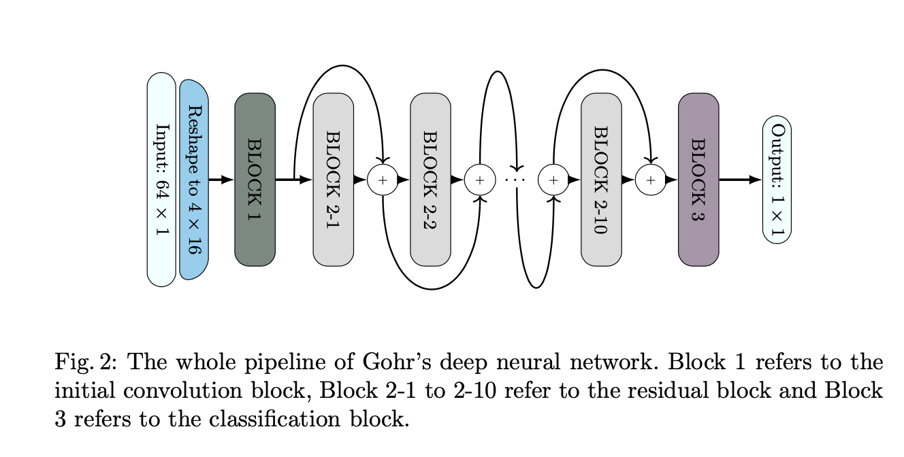

# Daily Notes and Progress

### Notes 25/05


### Notes 11/05
#### Training networks

So far, we've trained a lot of networks:
A few common outcomes occured.
Often, especially when giving padded plaintexts as labels, we have a network that always outputs all 0's. This is as low as the loss function can get given the network architecture. Convergence often happens fast, as low as 1 or 2 epochs. 
Also, we often have a network that gives a fix output, not necessarily all 0's. And sometimes, this output has even 0 correct bytes. Sometimes it does. The network learns something, but is far from learning anything useful.
In some other approaches, we had a completely unsuccesful network but that didn't output a fixed configurationm which is what we aim for. Once we have a network of this type, we can try to add a text correction layer.

What we want to try now:

- Add validation during training, to have some trianing accuracy
- Feed forward with BatchNormalization
- Feed forward with smaller batch size, less epochs (between 1 and 10)
- Feed forward units - units*2 - units*2 - units
- lr = LearningRateScheduler(cyclic_lr(10,0.002, 0.0001));
- Residual Network
- Conv1D (Gohr)
- https://github.com/differential-neural/An-Assessment-of-Differential-Neural-Distinguishers/blob/main/cipher/speck.py


An assessment of differential-neural distinguishers (Neumann) search eprint 2022 1521

Other possible directions

### Goals for week 8
- [X] Write an intro for the report
- [X] Create + train deep feed forward
- [X] Create + train deep residual
- [X] Hyper-parameter tuning ?


### Notes 24/04
#### ASCII correction
We want the model to output correct ascii characters. For this, we iterate over each byte and if it is not in our validity set (ascii characters), we pick the first valid byte with the smallest hamming distance to the invalid byte.

#### Accuracy metric
During training, the model will have a certain accuracy.
- Accuracy = (#correct predictions)/(#total predictions)
- LogLoss penalizes false classifications, works well for multiclass
- Binary Accuracy calculates how often predictions match binary labels.

But we also want a custom accuracy metric for testing the network enchanced with ascii correction (and text correction). Ideas:
- Byte accuracy: in total, over the whole test set: how many bytes were correctly recovered ? (correct bytes / total bytes)
- Accuracy: (correct words / total words)


### Notes 19/04, 20/04 (Week 8)

Today, make the whole code more modular and easier to work with. My focus is taking a step back and understand better what my network is doing, because until now all the performances were so bad that for any input it only outputs all zeroes, or sometimes a 1 somewhere. Getting back to smaller models. Understanding better the loss function so I can choose a good one. 
Why all zeros and not garbage ? What if I force it to train with non pseudorandom data ?
- Activation function for output layer:
**Softmax** would be more for classification, with results adding up to 1.
**Sigmoid** ouptus the probability that the value is '1' for each neuron.

- Loss function for training:
**Binary crossentropy**: popular for binary classification problems (try it!)\
**Mean square error**: popular for regression\
**Sparse categorical entropy**: multiclass classification problems (try it!)\

- Optimizer:
**Adam** is the number 1 choice. Should have a variable learning rate:
<https://keras.io/api/optimizers/> (lr_schedule)

- <https://ai.stackexchange.com/questions/36014/what-model-can-solve-vector-to-vector-prediction> (Check this out)
- <https://www.asciitable.com>
- <https://www.iiisci.org/journal/pdv/sci/pdfs/GS315JG.pdf>


### Notes 17/04 (Week 8)

Building a residual neural network. The following image is what we call a residual block. 
I think the networks do not learn and always predict the same value.


<https://towardsdatascience.com/building-a-resnet-in-keras-e8f1322a49ba>


### Notes 15/04

Building the deep forward neural network, I observe that I have a lot of nan values in loss and predictions. Deeper networks are harder to optimize, and accuracy may drop. This problem is kind og solved with residual neural networks and their skip layer.
I should normalize the data, like they do in the residual network.
I will directly build the residual network as the feed forward does not seem very promising.

### Notes 13/04 (Holiday week)

#### Report plan (tentative)
- <https://github.com/HexHive/thesis_template>
- title idea: can naive deep learning break crypto/pseudorandomness ?

0. Abstract

1. Introduction: background, motivation, context, goal, contribution\
Using naïve, top of the shelf deep learning techniques to attack secure ciphers. Easy to create a lot of data. Narrowing approach, assumptions, using more advanced DL/inspired by existing papers. Try to get something out of this pseudorandomness.

2. Related Work
All papers about this subjects, narrowing to the ones of most interest. From very precise cryptanalysis to broader attacks (more recent work) that actually work (under assumptions)

3. Experiments
Early experiments, applying NN's from papers, our custom method (with corrector)

4. Evaluation and Results

5. Conclusion

#### Neural network

Use an embeddings/vectorization layer to convert non-uniform size input as formalized input for neural network.\
What we'll test:
- Deep Feed Forward (Jaewoo So)
- Deep Residual Network (Hyunji Kim, Sejin Lim, Yeajun Kang, Wonwoong Kim, Hwajeong Seo)
- Convolutional Neural Network (Gohr)
- Maybe explore Encoder Decoder (used in translation)


### Goals for week 6/7
- [X] summarize all neural networks and results so far, clean code
- [ ] Week 7: Start working on report (plan/structure/main idea)

### Goals for week 6
- [ ] implement more complex networks from papers
- [ ] high level architecture building blocks
- [ ] code for modular high level architecture

## Notes 27/03 (Week 6)

<https://keras.io/api/keras_nlp/tokenizers/sentence_piece_tokenizer/>

### Creating new dataset
We separate into groups of words, with minimum 16 characters and maximum 128 characters (1024 bits)

### Spelling corrector
This model can correct text that's output by our neural network
<https://huggingface.co/oliverguhr/spelling-correction-english-base>

Can this be the final layer of our own neural network ? 
So we can compute accuracy etc. the correction applied.


## Notes 23/03 (Week 5)


### High level architecture
The following diagram defines the architecture of the model we're trying to achieve. 


## Notes 22/03 (Week 5)

### Goals for week 5

- [X] smaller ciphers (Simon, Speck) with generic neural networks
- [X] guess sum of bits in first bytes (fourth_nn)
- [X] start studying more complex neural networks (from papers)
- [ ] implement more complex networks from papers
- [X] ~~text correction model (correct utf-8 bytes)~~
- [ ] ~~find round-reduced AES library~~

### TODO
- [ ] study Bit Accuracy Probability as an accuracy metric
- [ ] Jaewoo So network structure on Speck
- [ ] Kim, Lim, Kang, Seo network structure


### Improving network structure
Now we start studying some more adapted, advanced and better performing network structure. First, let's do a review of what has been done in the papers we studied, check their advantages and why they could perform better in our settings.

Aaron Gohr:
- Residual tower of 2-layer convolutional neural net with initial convolution
- <https://github.com/agohr/deep_speck/blob/master/train_nets.py>
1. Block 1: a 1D-CNN with kernel size of 1, a batch normalization and a ReLU activation function
2. Blocks 2-i: one to ten layers with each layer consisting of two 1D-CNN with kernel size of 3, each followed by batch normalization and a ReLU activation function.
3. Block 3: a non-linear final classification block, composed of three percep- tron layers separated by two batch normalization and ReLU functions, and finished with a sigmoid function.


Jaewoo So:
- _(m,n)_ S-DES, Simon, and Speck
- where _n_ is the block size and _m_ is the key length
- objective: find key **k** 
- _M_ pt-ct pairs encrypted with the same key (known plaintext attack)
- 64 input nodes, each neuron at the input layer associates each bit of the plaintext and ciphertext
- 64 output nodes, each neuron at the output layer associates each bit of the key
- 5 hidden layers with 512 neurons each
- activation function: RELU
- 5000 epochs
- 0.008 learning rate
- loss: MSE
- 50'000 training samples
- Moreover, automated ML (AutoML) has been proposed to design and train neural networks automatically 


Hyunji Kim, Sejin Lim, Yeajun Kang, Wonwoong Kim, Hwajeong Seo:
- Residual Connection in Neural Network: allow the data to skip some layers, in order not to loose some information (gradient vanishing problem)
- Gated Linear Units (GLU)
- pair of ciphertexts and plaintext
- real key k is used as a label for the data to be trained on
- concatenate plaintext and ciphertext as input of ANN for supervised learning
- they used Fully Connected NN, because crypto algos has a property that most or all bits are affected when a single bit is changed, and half of the ciphertext is statistically changed when a single bit of the plaintext is changed
- it is difficult for data for learning to have locality in which adjacent features have similar values, and it is not temporal data having time information
- loss: MSE
- accuracy: BAP
- optimizer: Adam
- The range of learning rate from 0.001 to 0.1. Learning rate decay use the large learning rate value at first, and then the value gradually decreases. This allows the neural network to achieve optimal training result faster.
- epochs: 100-150


### Trying to guess sum of first byte of Speck32/64
After having no success in guessing the first byte of the plaintext from a ciphertext output (fixed key), we try to guess the number of 1's in this first byte. Again with a simple sequential neural network, parameters and hyperparameters similar (but adapted) to the previous neural networks. The network does not seem able to learn anything, as the loss stays constant and the accuracy is about 1/9 (which is the same as guessing at random).

### Enhancing byte-guessing neural networks
To make the neural network that tries to guess a byte of the plaintext better, we can validate its guess with a UTF-8 byte validation algorithm <br>
<https://www.youtube.com/watch?v=v7fXzLGSReQ> ?


## Notes 20/03 (Week 5)

### Guessing one byte

When guessing a byte, knowing that the plaintexts are utf-8 encoded, we can extend the neural network with an algorithm that "corrects" the byte. The fact that the characters are encoded reduces the byte space. Some bytes  output by the neural network may not be valid in UTF-8, so the algorithm can for example pick the character with the lowest hamming distance.

### Lightweight Ciphers

We'll also create a dataset with a lightweight cipher and use very naive generic neural networks to try to guess a bit of the keys. Some lightweight ciphers examples are: [_LEA_](https://en.wikipedia.org/wiki/LEA_(cipher)), [_Speck_](https://en.wikipedia.org/wiki/Speck_(cipher)) which is optimized for software implementations and [_Simon_](https://en.wikipedia.org/wiki/Simon_(cipher)) which is optimized for hardware implementations. Both _Speck_ and _Simon_ have a Python library: <https://pypi.org/project/simonspeckciphers/>

#### Generic neural network

- 4 Layers
- Dataset took 14 minutes to load
- 6.9 million samples
- Trained on Speck32/64 ciphertexts as samples and first byte of plaintext as labels
- Total params: 12,008

### Reduced-Round AES, S-DES

No reduced-round AES library for python and no way to set number of rounds. An option would be a custom implementation.
<https://alexscottrhodes.com/blog/post/30/>\
Could try S-AES (Simplified AES), which is an implementation of AES with smaller blocks and keys.
Python library: <https://github.com/mayank-02/simplified-aes>


## Notes 16/03 (Week 4)

### Goals for week 4
- [X] read paper dl-based cryptanalysis of lightweight ciphers, revisited
- [X] read paper dl-based cryptanalysis of lightweight ciphers
- [X] different approach (plaintext recovery from fixed key)
- [ ] train conv1D classifier

### New neural nework (fourth_nn.ipynb)
Learned!
But did it just learn bit distributions or did it learn from the ciphertexts ?

### Questions
- Try to extend some lightweight cipher neural-distinguishers to larger ciphers ?
- Or reduce the naive approach to lightweight ciphers ?


### Plaintext distribution
A bias we observe in the plaintexts is that UTF-8 characters always start with the 0 bit. So guessing the first bit will be easy.
What other bit positions in the plaintexts have a large probability ? Should the neural network try to guess the whole plaintext (from the ciphertexts). I will try training a network that guesses the first byte (instead of the first bit).
Then we'll try to see, in this byte, which bits he can predict well.
Can we directly check the "by bit" accuracy ?

### Naive approach
Once we covered most naive approaches, that will likely not work so well, we should explore some more precise, less naive neural networks, like in some papers.


## Notes 13/03 (Week 4)

### Clarifying my approach (so far)
**On one hand**, explore existing papers on the subject (review of the litterature), which is attacking ciphers directly with DL-based tools (not side-channel analysis whatsoever). This "wave" started with Gohr's paper in 2019, with many follow ups and similar approaches. They mostly attack lightweigth ciphers. Observations:
- neural networks have complex and educated structures
- attacked ciphers are lightweight
- based on existing cryptanalysis techniques

**On the other hand**, I explore this approach on my own. I use a more naïve at first approach (for now), with very basic neural networkd. I try it on a more "heavyweight" cipher (AES). I try a few different approaches:
- try to guess first bit of the key knowing plaintext/ciphertext pairs
- fixed key, try to guess _some_ bits of the plaintext from the ciphertext only

## Notes 08/03 (Week 3)

### Explore other approaches
Plaintext recovery:
Fixed key
try to guess from ciphertext first bit of plaintext
several bit position
compare accuracy with the bias of the data
(if plaintext has a 58% chance of being 1 and accuracy is 58% !!!)
difference is important

### Making the second neural network better
Reminder:
Sequential model builds a linear stack of layers. Batch size is how many samples are included in one batch and epochs is how many time the model will be trained on all the training data. 
Questions: 
- Q: How to choose `units` (the number of neurons) for each layer ?
- A: We'll start by having the hidden layers than the input layer, then we'll gradually make them larger, and if possible twice as large. And for now, we'll keep it simple with all hidden layers having the same size.
- Q: How to choose the batch size?
- A: Larger batch sizes result in faster progress in training, but don't always converge as fast. Smaller batch sizes train slower, but can converge faster. It's definitely problem dependent.
- Q: How to choose epochs?
- A: the models improve with more epochs of training, to a point. They'll start to plateau in accuracy as they converge. Try something like 50 and plot number of epochs (x axis) vs. accuracy (y axis). You'll see where it levels out.
- Q: How many units for the output layer ?
- A: `Dense(num_outputs, activation='softmax')` with `num_outputs=1` if we want to have the classifier's decision (0 or 1) and, and `num_outputs=2` if we want a tuple with probabilites, for example (0.51, 0.49). 

#### Loss function
Choosing a loss function depends on the number of output units. For now we choose 1 unit. Because we just want the classifier's decision.
Therefore, we can't use `sparse_categorical_crossentropy` for our loss.

#### Experiment 1
- 4 hidden layers with 16 units (total params: 4,945)
- loss: MSE
- 654'364 samples
- batch_size: 500
- epochs: 50

Result:
The network doesn't learn anything at all (loss and accuracy remain the same during all the training process).
- Test loss: 0.4996006190776825
- Test accuracy: 0.5003993511199951

#### Experiment 2
- 4 hidden layers with 64 units each (total params: 28,993)
- loss: MSE
- 654'364 samples
- batch_size: 500
- epochs: 50

Result:
Again, the network does not learn.

#### Experiment 3
- same as #2, but with `loss='sparse_categorical_crossentropy'`
- 2 output units

Result:
The network learns something but the validation accuracy is still close to 0.5, often being less. 
- Test loss: 0.7148967385292053
- Test accuracy: 0.4984845221042633

#### Experiment 4
- try with 256 units per layer
- 197'890 parameters
- try with more data (more than 1 million samples)
- output layer has 2 units
- `loss='sparse_categorical_crossentropy'`

Result:
Trained in 17 minutes, with accuracy around 0.5001 in the beginning and 0.5032 at the end, but validation accuracy not evolving much. 
- Test loss: 0.6986197233200073
- Test accuracy: 0.5006440281867981


### Sources
<https://medium.datadriveninvestor.com/building-neural-network-using-keras-for-classification-3a3656c726c1>
<https://towardsdatascience.com/beginners-guide-to-building-artificial-neural-networks-using-keras-in-python-bdc4989dab00>

### Data pipeline
Separated data pipeline into `dataset.py` for better modifiability and reusability accross different notebooks. The pipelines takes about 3 minutes. May be able to parallelize it.


## Notes 06/03 (Week 3)

### Deep Residual Neural Network with 1D-convolution
The deep residual tower from Gohr's paper was replicated and adapted to our data, using a depth of 3 convolutional layers plus the prediction head. It trained for 8 minutes (50 epochs). On the testing data, it gave an accuracy of 0.501 which is better than our second neural network.
Further work should me using GPU and training it on more data for a longer time.
Also, after choosing a good network topology, we should move on to hyperparameter tuning.
<https://github.com/agohr/deep_speck/blob/master/train_nets.py>

### Deeper Neural Network
A second neural network, with 4 dense layers (24,898 params) was trained and evaluated on the dataset that's almost 1 million pairs. Training it for 50 epochs gave us an accuracy of almost 0.6 but mostly due to overfitting, as evaluating it gave an accuracy of 0.5 which is like choosing uniformly at random.
<https://keras.io/guides/functional_api/>
<https://keras.io/guides/training_with_built_in_methods/>
<https://keras.io/guides/sequential_model/>

### Larger Dataset
To create a larger data set and avoid padding with whitespaces, we'll take a long text and cut it every 16 bytes to obtain plaintexts. For now, we use several books (in .txt format) as plaintext. We can easily add any books as input to make the set larger. The dataset is separated into training set and testing set (70% - 30%).
 <https://gutenberg.org>


### Goals for week 3
- [ ] define success metric for our neural network
- [X] create a larger training set
- [X] create a test set
- [ ] research what type of neural network should be used
- [X] denser shallow NN (with 4 layers)
- [X] 1D convolutional network
- [X] presentation on Gohr's paper + talk + follow up paper


## Notes 01/03 (Week 2)

### Data set
Need:
- Training and validation set
- Test set

### Notes on Gohr's talk at Crypto 2019 and Tan's talk at EUROCRYPT 2021
See papers.md

**Differential cryptanalyis:** 

<https://en.wikipedia.org/wiki/Differential_cryptanalysis> 

Chosen plaintext attacks, with pairs of plaintext related by a constant difference. Often defined by XOR. Attacker then computes difference in corresponding ciphertexts. 
"In the most basic form of key recovery through differential cryptanalysis, an attacker requests the ciphertexts for a large number of plaintext pairs, then assumes that the differential holds for at least r − 1 rounds, where r is the total number of rounds. The attacker then deduces which round keys (for the final round) are possible, assuming the difference between the blocks before the final round is fixed. When round keys are short, this can be achieved by simply exhaustively decrypting the ciphertext pairs one round with each possible round key. When one round key has been deemed a potential round key considerably more often than any other key, it is assumed to be the correct round key."
Input difference must be carefully selected for any particular cipher. Standard method is to trace a path of highly probable differences through the various stages of encryption. "New designs are expected to be accompanied by evidence that the algorithm is resistant to this attack and many including the Advanced Encryption Standard (AES), have been proven secure against the attack."

### Presenting a paper

Introduce the subject.
Talk about the sources and the method.
Indicate if there are conflicting views about the subject (conflicting views trigger discussion).
Make a statement about the new results.
Use visual aids or handouts if appropriate.

## Notes 27/02 (Week 2)

### First trained model
With 234'450 samples, I trained a Sequential NN with 3 hidden layers.
The shape and hyperparameters were completely arbitrary, with no further research on what shape, loss-function, accuracy metric, learning rate, number of epochs or batch size should be used. This model is just used to get something started with Keras.
It took about 11 minutes to be trained. It's final accuracy was 0.5314, which is very close to guessing at random. (We want low loss and high accuracy)

### What type of neural net
Feed Forward Neural Network are good for computer vision and pattern recognition, but is not suitable for deep learning.
Is our problem more of a classification problem, "time series prediction" or some sort of pattern recognition ?
There might be some pattern, but very loosely.
- Try a 1-dimensional convolutional neural network
- Add more layers (total of 4 layers) to my sequential model.
- A total of more neurons


### Questions
- Is there a better way to preprocess the data ? Something else to do ?
- Is there another to define the input and the output of the NN ?
- What type of neural network is best for our use case? Test several (Gohr uses 2-layer convolutional NN)
- How much training/testing data do we need ?

### Dataset
The current dataset is made of a word list. Words shorter than 16 bytes (128 bits) are padded, and longer ones a stripped.
An improvement will be to take a long text and cut every 16 bytes. This will make the dataset more diverse but also maybe more correlated. 

## Notes 22/02 (Week 1)

### Goals for week 2

- [X] cryptographic primitives
- [X] define problem clearly: input/output of the classifier
- [X] create a (small) dataset with a wordlist and AES
- [ ] preprocess data (into numpy arrays)
- [ ] get started with Keras (or PyTorch)
- [ ] start with a blackbox neural network
- [ ] define success metric for our neural network

### Questions
- Should all keys be different ? random ? For now: using random keys for each plaintext.
- Should all plaintexts be different ? english words ? For now: either pad (with whitespaces) or strip each word of the word list. Improvement can be done.
- In what mode of operation should we use AES ? We will use ECB mode, so we don't have to deal with nonces. We will also assume (at first) every plaintext is the size of blocks. This way we have "pure" AES, as a PRNG.
- As plaintexts (and keys) have to be exactly 16 bytes (128 bits) in our setting, should we pad words or take groups of words larger than 16 bytes ?

### First classifier idea

Given a plaintext/ciphertext pair, we want our neural network to "guess" the first bit of the key. 


### Advanced Encryption Standard (AES)

AES is one of the most widespread block ciphers (symmetric-key encryption) in use. It has a fixed block size of 128 bits, and key lengths of 128, 192 or 256.

```
AES encryption(s, W):
    AddRoundKey(s, W_0)
    for r = 1 to Nr-1 do:
        SubBytes(s)
        ShiftRows(s)
        MixColumns(s)
        AddRoundKey(s, W_r)
    end for
    SubBytes(s)
    ShiftRows(s)
    AddRoundKey(s, W_Nr)
```
#### Setup

As plaintexts, we will use english words. We will use 128 bits keys for performance and memory concerns.
We will use ECB mode with only one block. Having several blocks would attack the mode of operation, as it is insecure (because it exposes correlation between blocks).


### Resources

- <https://pycryptodome.readthedocs.io/en/latest/src/cipher/classic.html#ecb-mode>
- <https://pypi.org/project/english-words/>
- <https://keras.io/getting_started/intro_to_keras_for_engineers/>

## Notes 20/02 (Week 1)

- Advanced Crypto ?
- EPFL Gitlab with notes, code, add Ritam
- First do a simple classifier that given English word input/AES output, says if the key starts by 0 or 1. Find a large corpus of english words, use built-in AES to generate pairs (training and testing sets). Train a simple (deep or shallow) neural net. Make everything modular, so we can easily swap ciphers or datasets.
- Other approach is to use random inputs. Didn't quite understand this.
- Does AES require a key and an input or just an input ?
- Report in LaTeX (due 09.06.2023)
- Code: Python (jupyter notebook)
- Duration of project: 14 weeks with 18 hours of work per week
- Total workload: 312 hours of work for 12 credits
- INF 218

### TODO

- Keep reading papers + reference papers
- Understand differential attacks

## Notes 29/01

PyTorch vs Keras
Keras more plug and play, first quick experiment and such, high level API, easy to use. Good for fast prototyping.
PyTorch better debugging capabilities, better for scientific/research approach, create and perfect my model, or with larger dataset. A bit lower level.

### Resources

- <https://www.youtube.com/@NicolaiNielsenAI>
- <https://www.youtube.com/watch?v=v43SlgBcZ5Y>
- <https://www.youtube.com/watch?v=V_xro1bcAuA>
- <https://research.nccgroup.com/2021/10/15/cracking-random-number-generators-using-machine-learning-part-1-xorshift128/>

### Questions

- What does it mean "cracking" a PRNG? guess seed? distinguish from truly random?

## Notes 29/11/22

### About the project

- research and try something out
- may find nothing, or result might be that it's not really possible
- read papers, and some reference papers
- some cryptanalysis papers and notions
- idea: classifier

### Papers

- <https://ieeexplore.ieee.org/stamp/stamp.jsp?tp=&arnumber=8350369>
- <https://eprint.iacr.org/2019/037.pdf> (especially this one)
- <https://eprint.iacr.org/2021/287.pdf> (and this one)
- <https://eprint.iacr.org/2022/886.pdf>
