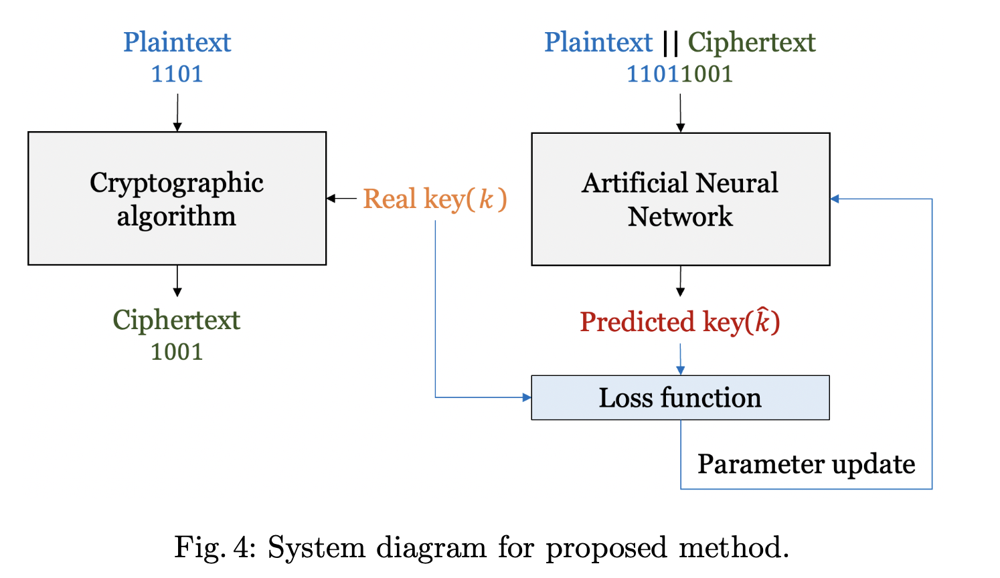

# Notes about research papers

## Research on Plaintext Restoration of AES Based on Neural Network

**(Hu, Zhao) [2018]**

#### 0. Abstract
Attempt to restore plaintext with backpropagation neural networks.
Result: neural net can restore byte with probability 40%.

#### 1. Introduction
In this paper: cyclic neural network (RNN)
AES algo in CBC and EBC mode
Without knowing the key, the plaintext is restored from the ciphertext
The results show that the plaintext restored by the AES-128 and AES-256 algorithms over the neural network is more than 63% higher than the plaintext compared with the original plaintext

#### 2. Cryptanalysis Process Based on Neural Network
(ciphertext -> neural network -> plaintext)

#### 3. Experimental Design and Parameter Selection
- 4 hidden layers: 128, 256, 256, and 128 neurons
- MSE
- cascaded feedforward BP neural network: every layer has every layer as input (including input layer)

#### 4. Experimental Result
- with random and non-random inputs

## Deep Learning based Cryptanalysis of Lightweight Block Ciphers, Revisited

**(Kim, Lim, Kang, Kim, Seo) [2022]**

#### 0. Abstract
Propose a cryptanalyis method based on DL with state of the art network topologies for lightweight ciphers (S-DES, S-AES). Reduce number of parameters needed by 93% (reduced from what ? "compared to previous work"), increase bit accuracy probability by 5.3%.

#### 1. Introduction
- Cryptanalysis for block ciphers
- various methods: ciphertext only attack, chosen- plaintext attack, chosen-ciphertext attack, known-plaintext attack, differential analysis, and side-channel analysis
- this paper: deep-learning based cryptanalysis (for lightweight ciphers)
- fewer parameters, higher accuracy

**Contributions:**
- Designing artificial neural networks considering the characteristics of cryptographic algorithms (various were tested)
- Improving performance for S-DES cryptanalysis (with dl)
- The first cryptanalysis based on deep learning for S-AES (known plaintext attack)
- cryptanalysis based on deep-learning up-to 12- bit key space is possible
- comparison between S-DES and S-AES

#### 2. Related works
**Artificial neural networks:**
- Residual Connection in Neural Network: also the data to skip some layers, in order not to loose some information (gradient vanishing problem)
- Gated Linear Units (GLU)

**Artificial Neural Network based Cryptanalysis:**
- attacks against Caesar cipher, Vigenere cipher, Simplified-DES, round-reduced SPECK, and round-reduced SIMON
- case of S-DES: cryptanalysis was possible for both the random bit key and the text key
- Speck and Simon: Cryptanalysis is failed for random bit keys and succeeded for text keys (keyspace is 248 and key occurrences are different)

#### 3. Proposed method
- cryptographic algorithm is used to obtain a pair of ciphertexts and plaintext
- real key k is used as a label for the data to be trained on
- concatenate plaintext and ciphertext as input of ANN for supervised learning
- NN can predict correct label: output is k' (predicted key)

- when the length of the plaintext is m, the data has a length of 2m, and when input to the neural network, one bit is assigned to each neuron
- sampled plaintext and keys randomly
- S-DES: 8-bit plaintext, 10-bit key, 100'000 samples
- S-AES: 16-bit plaintext, 16-bit key, 1.6 million samples

**Neural Network structure for cryptanalysis:**
- Fully-Connected Neural Networks
- Convolution Neural Networks
- Recurrent Neural Network
- they used FCNN, because crypto algos has a property that most or all bits are affected when a single bit is changed, and half of the ciphertext is statistically changed when a single bit of the plaintext is changed
- it is difficult for data for learning to have locality in which adjacent features have similar values, and it is not temporal data having time information
- CNN and RNN are good for data with temporal locality

**For S-DES:**
- number of neurons in the input layer = 16 (each bit is input to each neuron) 
- number of neurons in the output = 10 (number of key bits).
- training for 10h
- loss: MSE
- optimizer: Adam
- learning rate: from 0.001 to 0.1
- epochs: 100
- testing: compare k' with actual k, BAP. Poor training if BAP < 0.5. (calculating the accuracy by bit, they found that not all bits have the same accuracy) --> some bits are more vulnerable than others.

**For S-AES:** 
- number of input neurons = number of bits of input data
- overall, deeper and larger as the one for S-DES but same structure
- loss: MSE
- optimizer: Adam
- learning rate: from 0.001 to 0.1
- epochs: 150

#### 4. Evaluation

**Comparison between the 2:**
- S-DES: when the key space increases by 1-bit, the number of parameters increases by about 1.5 times
- S-AES when the key space increases by 1-bit, the number of parameters increases by about 2-3 times
- S-AES: lower accuracy, more parameters required
- expected as S-AES is more secure

## Deep-Learning based Cryptanalysis of Lightweight Block Ciphers

**(So) [2020]**

#### 0. Abstract
Generic cryptanalysis model based on DL (try to find key of block ciphers from known pt-ct pairs). Show feasibility on simplified DES, Simon, and Speck. 
Text-based key, showing DL technology can be a useful tool for the cryptanalysis of block ciphers when the keyspace is restricted.

#### 1. Introduction
- Need automation
- Known cryptanalysis attacks or techniques only successful on round-reduced variants of ciphers. No successful attack on full-round Simon or Speck.
- need an automated and generalized test tool for checking the safety of various lightweight block ciphers (especially for IOT)
- First, propose generic DL-based cryptanalysis model
- Second, perform attacks on lightweight ciphers.
- first attempt to successfully break the full rounds of Simon32/64 and Speck32/64 (but only with text-based keys).

#### 2. Related work
- Some studies focused on finding the characteristics of block ciphers by using ML technologies
- Some studies used ML to classify encrypted traffic or to identify the cryptographic algorithm from ciphertexts
- Third, studies try to find out the mapping relationship between plaintexts, ciphertexts, and the key
- An author developed a feedforward neural network that discovers the plaintext from the ciphertext without the key in the AES cipher (Paper: )
- All failed to attack full-round ciphers, and failed to develop generic model

#### 3. System model
- _(m,n)_ S-DES, Simon, and Speck
- where _n_ is the block size and _m_ is the key length
- objective: find key **k** 
- _M_ pt-ct pairs encrypted with the same key (known plaintext attack)

#### 4. Deep Learning-based approach
- Deep neural network

#### 5. Model training and testing

#### 6. Evaluation

#### 7. Conlusions
- When a text key is applied, the DL-based attack broke the S-DES cipher with a success probability of 0.9 given 28.08 known plaintexts
- When a text key is applied, with a success probability of 0.99, the DL-based cryptanalysis finds 56 bits of Simon32/64 with 212.34 known plaintexts and 56 bits of Speck32/64 with 212.33 known plaintexts, respectively
- generic so can be applied on other lightweight ciphers without change
- drawback: keyspace reduced to text key

## A Deeper Look at Machine Learning-Based Cryptanalysis

**(Benamira, Gerault, Peyrin, Tan) [2021]**

**0.Abstract**\
Follow-up on Gohr's paper, weaknesses being unexplainability (black-box, therefore not helping improving the algorithm). This paper provides more analysis and explanation about the neural distinguisher. Improves non-neural distinguisher for SPECK, strips down Gohr's neural distinguisher to the minimum. Show Gohr's neural distinguisher provides a good approx of the Differential Distribution Table of the cipher. Improvement of Gohr's work, contribution to deep learning interpretability.

**1. Introduction**\
A goal is to optimize/automate the cryptanalysis process and toolbox.
Their contribution was to make and confirm hypotehsis on what the neural network based itself upon to work. They recreated one and also used it on another cipher.

**2. Preliminaries**\
A Difference Distribution Table (DDT) lists the differential transition probabilities for each possible input/output difference pairs

**3. A First Look at Gohr’s CRYPTO 2019 Results**\
Real/random pairs depending on the score (under 0.5: random)

**4. Interpretation of Gohr’s Neural Network: a Cryptanalysis Perspective**\
What type of cryptanalysis is Gohr’s neural distinguisher learning?
Is it a new form or improved-exisiting form?
They trained a neural net with the difference between ciphertexts (instead of pairs) because Pure Differential Distinguishers only have this information. Makes the comparison fair.
Application to AES

**5. Interpretation of Gohr’s Neural Network: a Machine Learning Perspective**\
Can Gohr’s neural network be replaced by a strategy inspired by both differential cryptanalysis and machine learning?
They demonstrate that it is possible.
Gohr’s neural network outperforms other non-neuronal network machine learning models.

### Notes on Tan's talk at EUROCRYPT 2021

<https://www.youtube.com/watch?v=fjqtCNv72II>

Preliminaries:
- Block size: 32, key size: 64 (Speck32/64)
- Gohr 2019: neural distinguisher compared to pure differential distinguishers (neural did better job), improved complexity of 11-round key recovery attack
- Structure of Gohr's distinguisher: input = pair of ciphertexts (encoded in binary), passes through multiple convoluted blocks (Conv1D), moving on to prediction head (Dense), outputs single value between 0 and 1
- Result is the score: <= 0.5 means considered as real (otherwise, considered as random)

Cryptanalysis perspective:
- main quest: what type of cryptanalysis Gohr's neural distinguisher is learning? can we replicate result w/o neural distinguisher with regular techniques ?
- reverse engineer what neural distinguisher does
- chosen differential characteristic
- retrain Gohr's ND using a (better) input difference (0x2800/0010)
- 75.85% accuracy (worse than 92.9%)
- enforce fairplay between neural and classical distinguisher: retrain the ND with just the difference (XOR) instead of whole ciphertext pair
- 90.6% accuracy (vs 92.9%)
- Experiment A: does the ND only recognize strong differences ? (<= 0.1 or >= 0.9)
- result: little evidence
- Experiment B: repeat but decrypt by some rounds using actual key ...
- result: using difference at n-1 or n-2 rounds, almost all have a score superior to 0.5
- Experiment D: assumption is that neural network has the ability to determine the difference of certain bits at rounds 3 and 4 with high accuracy (detect certain bit positions that are very biased, called TD3), confirmed by training a the NN with pairs that satisfy TD3, very high accuracy (and true positive rate almost 100%)
- Average key rank distinguisher, uses DDT generated with data set of size 107 (same amount of data as Gohr's ND, same time complexity)
- result: comparable accuracy, meaning that YES we can replicate result without NN
- result (type of cryptanalysis): perhaps differential-linear, because NN is able to take all possible correlations into account

Machine Learning Perspective:
- can Gohr's ND be replaced by a strategy inspired by both ML and differential cryptanalysis ?
- can it be applied to more rounds ?
- objective: replace each block of the ND by a more interpretable block coming from either ML or cryptanalysis
- ideas: ensemble classifiers (Random forrest), linear combinations, computing ddt's + masks
- result: accuracy very close to the ND
- extend pipeline to 6-round Speck and 8 round Simon

## Improving Attacks on Round-Reduced Speck32/64 Using Deep Learning

**(Gohr) [2019]**

Talk: importance of trying easy problems AICRYPT 21 (Gohr)

- What is his neural distinguisher doing ? (predict next number ? key recovery ?)

0. **Abstract** \
Idea: calculate prediction differences of Speck32/64 (a block cipher), show ML can produce powerful distinguishers, develop highly selective key-search policy, show that neural distinguishers use features of ciphertext-pair distribution. \
Contributions: 
- DDT of Speck32/64 with 1 specific input different
- DL-based distinguisher that performs better than classical
- Develop key search policy using distinguisher (improvement)
- Show neural distinguisher uses features of ciphertext pair distribution (that are invisible to classical distinguishers however much data)

1. **Introduction** \
- Teach neural nets to exploit properties of Speck
- Attack: Differential distinguishing attack
Create partial key recovery attack to allow comparison with exisiting (non-neural) attacks.
- Comparative paper between neural network based attacks and well-knwon cryptanalysis tools
- Combines both techniques (use NN to improve state of the art attacks)
- Neural network exploits differential proerties, distinguishes output of Speck from random data with given input difference
- Task: adversary has to distinguish between 3 ciphertext pair distributions that have exactly the same ciphertext difference distribution [?]
- Complexity (classical vs neural): 248 vs 2^38
- Data: 214 vs 214.5  ciphertext pairs

2. **Speck Family of Block Ciphers** \
Notations and conventions, Short description of Speck

- Markov cipher
- Multiple differential attack (input data with known difference distribution)
- Distinguisher: classifier with input d data sampled independently, outputs a guess for submitted input item *d*
- Speck32/64 (32 bit block size, 64 bits key size)

3. **Multiple Differential Attacks on Speck32/64** \
Pure differential distinguishers, Differential Distinguishers Using the Full Distribution of Ciphertext Pairs

- Calculating differential transition probabilities
- Cryptographic task: distinguish reduced-round Speck output with given difference from random data
- Classification as real or not
- Sources of error

4. **Neural Distinguishers for Reduced Speck32/64** \
Overview, network structure, training "real vs random" classifiers, results, key recovery attack, 

- Residual tower of 2-layer convolutional neural net with initial convolution
- Training/testing data: generated with Linux RNG
- 107 samples for training
- training for 200 epochs, batches of size 5000
- last 106 samples for validation
- optimization against MSE loss plus penalty based on L2 weights regularization (c = 10-5 ) using Adam algo. with Keras' default parameters
- cyclic learning rate
- networks at the end of each epoch were stored
- best network by validation loss was evaluated against test set of size 106 (not used in training OR validation)
- test set accuracy: neural distinguishers achieve higher accuracies than purely differential baselines on all tasks
- only mild overfitting
- ground truth was matched in 62.7% of the test sample
- basic attack: a key guess was output after processing on average 213.2 ciphertext pairs, can be accelerated

5. **The Real Differences Experiment** \
Experiment

- cryptographic experiment in which the adversary has to do differential cryptanalysis in a setting where the random and the real difference distribution are the same

6. **Conclusions**

- accuracy of neural distinguisher superior to the DDT, using less memory
- a lot of knowledge about DDT can be extracted from few million examples by black-box methods
- fairly generic method (no crypto knowledge beyond word-structure of cipher)
- finding good input differences is possible using their networks
- novel properties: ability to differenciate between ciphertext pairs within same difference class
- Speck32/64: small blocksize (certainly helped)
- further research: give the model trained more prior knowledge about cipher, extract more knowledge about model
- ML could be useful in addition of the usual cryptanalysis toolbox
- 

not understood: reduced, free key schedule

### Notes on Gohr's talk at Crypto 2019

Summary:
- ML to build differntial distinguisher
- superior to full difference distribution table [?] for round-reduced Speck
- distinguisher achieve higher classification accuracy
- exploits difference in ciphertext pair difference instead of the distribution of differences 
- the distinguisher is used in attack (key search), more efficient than previous attacks (millions of times faster), but because of training the NN cost, ~200 times faster
- NN has internal data representation that groups the output ciphertext pairs into more fine grained system of equivalence classes 

Speck32/64:
- Previous attacks relied on key schedule being efficeintly invertible (in opposition to neural distinguisher), 214 chosen plaintext

Difference Distribution (classical distinguisher):
- differential transitions from 1 round to another: trated as a Markov chain
- Cost: few hundred CPU days of computing, 35GB of memory for computed DDT

Other works:
- Klimov, Mityagin, Shamir (ASIACRYPT 2002): nn to break pke scheme based on nn
- Greydanus (2017): nn to simulate Enigma 
- Gomez et al. (ICLR 2018): GANs can break Vigenere ciphers in unsupervised settings

ML distinguisher for reduced Speck: 
- few million real/random samples with fixed input difference [?]
- train a deep residual neural network (succesful type of network for image recognition, board games)
- the NN distinguishes real from random samples !!! (classifier)
- residual tower of convolutional nn followed by dense prediction head
- around 44'000 weights (for nn with single residual block)
- small advantage over DDT
- attack on 7 round, can be extended to 9 round

Attack:
- key recovery policy
- do wrong subkey decryptions look like random data ? 
- key search policy: try to decrypt ciphertexts under few random keys, observe avg distinguisher responses, derive new key hypothesis (maximizing likelihood of distinguisher responses), repeat to converge towards key

Conlusions:
- ML worked well, NN exploits ciphertext pair distribution
- crucial to choose right learning task + good model structure
- good if used with manual cryptanalysis to derive competitive attack
- automatically derived efficient key search policy
- NN are NOT black boxes
- expected to also apply to other block ciphers
- maybe not obvious for Markov ciphers [?]
- <https://www.github.com/agohr/deep_speck>

Questions:
- Could you apply autoencoders to crypto ?

## Learning From Pseudo-Randomness With an Artificial Neural Network—Does God Play Pseudo-Dice?

**(Fan, Wang) [2018]**

0. Abstract:
Idea: demonstrate learning and prediction power of neural nets in pseudorandom environments.

1. Introduction:

- Supervised learning: label + input sample = training pairs
- Statistical learning: find high likelihood solutions, filtering out random noise
This paper studies extreme case of statistical learning: how much can a neural net learn from pseudo-random noise. It will use a neural net to predict the next number in a 0/1 sequence.
(Similarity to chaotic time-series)

2. Numerical studies and results
a) Learning from pi (is the infinite sequence the result of a perfect mechanism or not?)
Try to predict 7th number from the 6 precedents.
Neural net: 6-30-20-1 config, training on 40'000 instances, evaluated with 2 testing sets
Success rate: 51.28% (T1) and 51.03% (T2) (theoretically should be 50% if truly random).
Experiment repeated with e and sqrt(2)
b) PRNG's
Pseudo-random Number Generators takes a seed as input and outputs a sequence of numbers.
Mersenne Twister (MT) is the chosen PRNG to attack, associated with multiple seeds.
Same as a), predict 7th number from its precedents. Generated 9 sequences and repeated process 100 times for each, very differing success rates. Network inferred correlation in each training set.
c) Testing for number normality
(Hard and technical mathematical stuff)
Defining normal numbers
30 million first digits of pi are quite uniform.

3. Discussions and Conclusion
A good neural network would be an expression of the relationship between inputs and outputs.
Rademacher complexity: measures ability to fit completely random data.
Use of neural network in very uncertain environments is promising. GANs and RNNs could be even more interesting.

## How to read a paper

**(Keshav) [2012]**

### 3-pass approach
***1st pass:*** Read abstract and introduction, section/subsection titles, check out related papers and references. \
*Goal:* Category, Context, Correctness, Contributions, Clarity \
*Time: 5-10 minutes*

***2nd pass:*** Read with care but ignore details and proofs. \
*Goal:* Be able to summarize with supporting evidence. \
*Time: <1h*

***3rd pass:*** Virtually reimplement the paper. Challenge every assumption, jot ideas for future work. \
*Time: <5h*